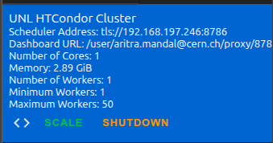

# TTbarHadronicSkimmer

This code can be run on either LPC or coffea.casa (hosted at UNL). We highly recommend using coffea.casa because it is upto 5x faster.

## LPC setup

### Login

```bash
ssh -Y -L 8XXX:127.0.0.1:8XXX LPCUSERNAME@cmslpc-el9.fnal.gov
```


### Setup

It is recommended to work on `nobackup` area in LPC.
```bash
cd nobackup
```
Initialise the `voms-proxy`
```bash
voms-proxy-init --rfc --voms cms -valid 192:00
```

Clone coffea-2025 branch of this repository.
```bash
git clone -b coffea-2025 https://github.com/mandalaritra1/TTbarHadronicSkimmer.git
```

```bash
cd TTbarHadronicSkimmer 
```
Setup lpcjobqueue by following instruction from [here](https://github.com/CoffeaTeam/lpcjobqueue). Afterwards, the singularity container can be run with:

```bash
./shell coffeateam/coffea-dask-almalinux9:2025.12.0-py3.12  
```

### (optional) Jupyter Lab

For interactive jupyter lab environment run the following command inside the singularity container: 
```bash
jupyter lab --no-browser --ip=127.0.0.1 --port=8XXX
```

Then copy the provided link to your browser.

## coffea.casa setup

Go to [coffea.casa](https://coffea.casa) and login using your preferred method.

Select the latest coffea image for 2025 and press `Start`.


Clone this repository:
```bash
git clone -b coffea-2025 https://github.com/mandalaritra1/TTbarHadronicSkimmer.git
```
Go to the `Dask` tab from left and click the *SHUTDOWN* button.



Open [`ttbaranalysis.ipynb`](ttbaranalysis.ipynb) and run with the CASA configuration.

## Running Jobs

### Interactive notebook

Open [`ttbaranalysis.ipynb`](ttbaranalysis.ipynb) and use the configuration widgets to select datasets, IOV, taggers, systematics, and execution mode. Settings are auto-saved to `.last_config.json`.

### Command line

```bash
python ttbaranalysis.py --iov 2024 --dataset TTbar
```

Common options:

| Flag | Description |
|---|---|
| `--iov` | Year: `2022`, `2023`, `2024` |
| `--dataset` | `data`, `TTbar`, `QCD`, `ZPrime1`, `ZPrime10`, `ZPrime30`, `ZPrimeDM`, `RSGluon`, `ZPrimeLocal` |
| `--era` | Filter to specific era(s), e.g. `--era C --era D` |
| `--subsample` | Run a specific manifest subsection, e.g. `--subsample QCD_PT-1000to1500` |
| `--noSyst` | Run nominal only (no systematics) |
| `--ntuple` | Collect flat per-event ntuple in the `.coffea` output |
| `--test` | Run on 1 chunk with 1 worker |
| `--blind` | Process 1/10th of data |
| `--ttagWP` | Top-tagger working point: `loose`, `medium` (default), `tight` |
| `--ht` | HT cut: `1400` (default) or `950` |
| `--dask` | Use Dask executor instead of futures |
| `--env` | `lpc` (default), `casa`, `winterfell`, `local` |
| `-r` | XRootD redirector URL (default: `root://cmsxrootd.fnal.gov/`) |

For now the analysis can run on 2022, 2023, and 2024 datasets.

Example for a single QCD pT bin:

```bash
python ttbaranalysis.py --iov 2024 --dataset QCD --subsample QCD_PT-1000to1500
```

## Deriving 2024 Top-Tag Working Points

The standalone top-tag WP workflow derives pT-binned GloParTv3 `TopvsQCD`
thresholds from QCD mis-tag targets, then reports the matched-TTbar signal
efficiency at those thresholds. It writes a histogram accumulator first, then a
JSON/plot summary.

On a laptop/Mac without XRootD, run only against the local ROOT file layout:

```bash
coffea-dask/bin/python run_toptag_wp.py \
  --env local \
  --rootdir /Users/aritra/Projects/rootfiles/ttbar \
  --out outputs/toptag_wp_2024_local.coffea
```

For a local smoke test, cap the input to one file per dataset:

```bash
coffea-dask/bin/python run_toptag_wp.py \
  --env local --test --maxfiles 1 \
  --rootdir /Users/aritra/Projects/rootfiles/ttbar \
  --out outputs/toptag_wp_2024_local_smoke.coffea
```

On LPC, the runner uses the full 2024 `data/nanoAOD/QCD.json` and
`data/nanoAOD/TTbar.json` manifests through `root://cmsxrootd.fnal.gov/` and
starts an `LPCCondorCluster`:

```bash
python run_toptag_wp.py \
  --env lpc \
  --out outputs/toptag_wp_2024_full.coffea
```

On coffea.casa, the same manifests are read through `root://xcache/`:

```bash
python run_toptag_wp.py \
  --env casa \
  --out outputs/toptag_wp_2024_full.coffea
```

For LPC/casa smoke tests, use `--test` to run two files per manifest dataset and
one chunk per dataset:

```bash
python run_toptag_wp.py \
  --env lpc --test \
  --out outputs/toptag_wp_2024_lpc_smoke.coffea
```

For QCD, the top-tag runner applies the same large-`genWeight` outlier rejection
used by `TTbarResProcessor` before filling histograms, and prints kept/raw event
counts plus the rejected count per dataset.

Run data separately when you want the discriminator Data/MC check:

```bash
python run_toptag_wp.py \
  --env lpc --sample Data \
  --out outputs/toptag_score_data_2024.coffea
```

After the Coffea output is written, derive the JSON thresholds and validation
plots. Add `--data-infile` to produce `data_mc_score_distributions.png`, where
the stacked QCD+TTbar MC is scaled to the data integral in each pT panel for a
shape comparison. This Data/MC plot uses the full preselected `mSD` range, so
the 2D alphabet sidebands are included; the WP derivation itself still uses the
`105 < mSD < 210` top-mass window.
The plot includes a hatched MC statistical uncertainty band and a `Data/MC`
ratio panel under each pT bin:

```bash
MPLCONFIGDIR=/tmp/mplconfig python plot_toptag_wp.py \
  outputs/toptag_wp_2024_full.coffea \
  --data-infile outputs/toptag_score_data_2024.coffea \
  --iov 2024 \
  --json data/toptag/toptag_wp_2024.json \
  --plotdir plots/images/toptag_wp/2024 \
  --score-rebin 10
```

`--score-rebin` only rebins `score_distributions.png` for readability; the
working-point derivation still uses the fine score histogram. The plotter also
writes `pt_distributions.png`, a preselected AK8 pT control plot for checking
whether the QCD spectrum and stitching are smooth.

## Output

The processor saves a `.coffea` file per dataset/era to `outputs/dy/`. Files are named automatically, e.g.:

```
outputs/dy/TTbar_2024_noSyst_test.coffea
outputs/dy/TTbar_2024_ntuple.coffea       # when --ntuple is set
```

## Flat ntuple (ROOT TTree)

When `--ntuple` is set (or the **Ntuple** checkbox is ticked in the notebook), a flat per-event ntuple is embedded in the `.coffea` output. Convert it to a ROOT TTree with:

```bash
python write_ntuple.py outputs/dy/TTbar_2024_ntuple.coffea TTbar_2024.root ttbar
```

No ROOT installation is required — `uproot` handles the file writing.

Branches stored: `jet0/1_pt`, `jet0/1_eta`, `jet0/1_phi`, `jet0/1_msd`, `jet0/1_tdisc`, `jet0/1_rapidity`, `ttbarmass`, `ht`, `dy` (Δy), `chi` (χ_dijet = exp|Δy|), `weight`, `anacat`, `run`, `lumi`, `event`.

## Viewing Histograms

To view basic histograms and systematic variations after running, use [`plots/syst_viewer.ipynb`](plots/syst_viewer.ipynb).

To plot distributions from the flat ntuple, use [`plots/ntuple_plots.ipynb`](plots/ntuple_plots.ipynb).
